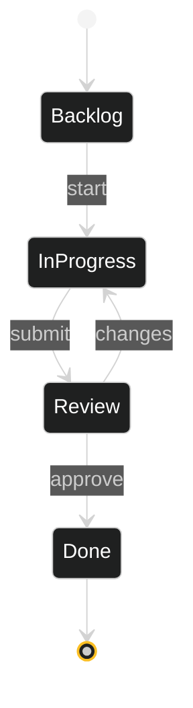

<div align="center">


[](https://github.com/Manashjyoti-Bora/taskflow-enterprise)&nbsp;
[](https://github.com/Manashjyoti-Bora/taskflow-enterprise)

</div>

> [!TIP]
> **This README is written as a kanban board** — because that is exactly what the app does. Read it the way the app works: left to right.

---

## 🗂️ THE BOARD

| 📥 BACKLOG *(what it needed)* | 🔨 IN PROGRESS *(how it was built)* | ✅ DONE *(what shipped)* |
|:---|:---|:---|
| Dynamic multi-column boards | Component-per-column architecture | Boards create/rename/delete |
| Live priority tagging | Derived state — no duplicated flags | 🔴 High · 🟡 Med · 🟢 Low tags |
| Sprint tracking | Date-window filtering logic | Sprint view with progress |
| Fast task CRUD | Optimistic UI updates | Instant add/edit/move/delete |
| Zero-lag interactions | Memoized lists, keyed renders | Smooth on a budget phone |

## 🔄 TASK LIFECYCLE



## 🔧 RUN IT LOCALLY

```bash
git clone https://github.com/Manashjyoti-Bora/taskflow-enterprise.git
cd taskflow-enterprise && npm install && npm run dev
```

## 🧾 RETROSPECTIVE *(the honest column)*

- **What went well:** state modeling — moving cards between columns taught me more about React state than any tutorial
- **What was hard:** keeping renders fast with many tasks — solved with memoization and stable keys
- **Next sprint:** drag-and-drop, then backend persistence (auth pattern ready in [NexusMart](https://github.com/Manashjyoti-Bora/nexusmart))

<div align="center">

*Built on an Android phone, one sprint at a time.*

<sub>Banner and animations on this page are hand-coded SVG — no generator services.</sub>

</div>
